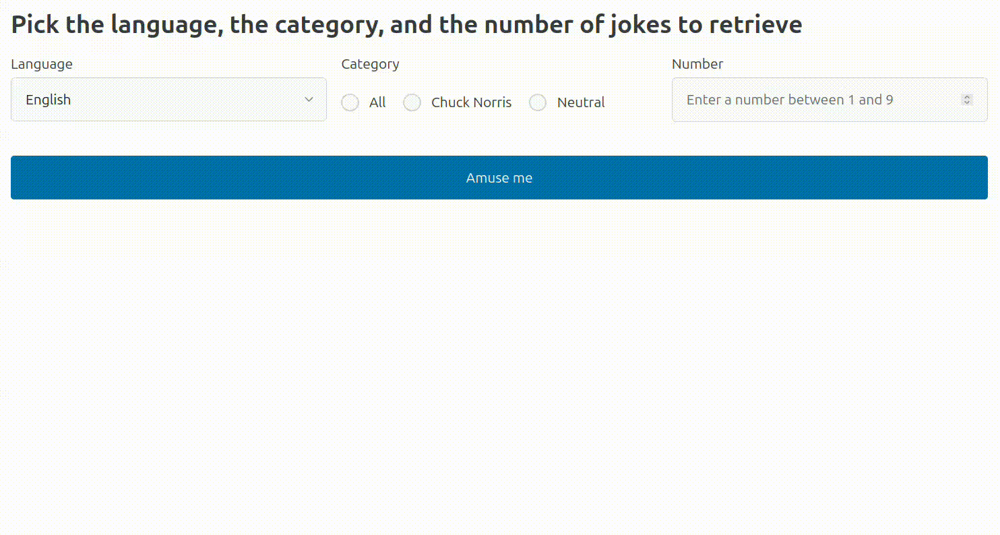

# Using Flask for Fun

## Description

Use *Flask* and [pyjokes](https://github.com/pyjokes/pyjokes) to build a web application that would allow users to select language and category of a joke and use *Jinja* to print the specified number of jokes from the selected category.
Use *Pico.css* to have a consistent user interface.

```python
>>> import pyjokes
>>> pyjokes.get_joke()
>>> pyjokes.get_jokes()
>>> pyjokes.get_jokes(language="de", category="neutral")
```

## Requirements

1. Implement the `query` function of the *logic.py* to return the specified *number* of jokes (`str`, default *1*) based on the *language* (`str`, default *en*) and *category* (`str`, default *neutral*).
    - Call `pyjokes.get_jokes()` to retrieve multiple jokes at once.
    - If the requested number is greater than the number of jokes available in the language/category, return all available jokes.
    - Preferably, shuffle the list of jokes before returning it.
1. Implement the `show_form` function of the *routes.py* to render the search form with the specified selection of languages, categories, and possible number of jokes (see the app initialization for specific values).
1. Implement `process_form` of the *routes.py* to handle the submitted `post` request.
    - Call `query` to retrieve the specified jokes from the `pyjokes` package.
1. Populate options of the `#languageField` element in the *index.jinja* using languages specified at the app initialization stage.
1. Populate `radio` options in the *index.jinja* using categories specified at the app initialization stage.
    - `id` of each radio option must be the code (*all*, *chuck*, or *neutral*) of the category
    - All radio options must be properly labeled (*All*, *Chuck Norris*, and *Neutral*)
1. Use the numerical field `#numberField` to allow users request a specific number of jokes.
    - Maximum and minimum number of jokes is specified at the app initialization stage.
1. Send a `post` request to the app on clicking button `#btnAmuse`.
1. If there are any jokes matching the criteria, populate the `#jokes` `section`, making each joke a separate `article`.
1. Use Pico HTML/CSS framework (included) to style the app.
1. Handle errors and exceptions gracefully:
    - Not every language/category combination has valid jokes, so you have to handle `pyjokes.exc.LanguageNotFoundError` and `pyjokes.exc.CategoryNotFoundError` by raising a `ValueError` with a specific message (see the test suit for the message).
    - If a function is mistakenly called with a parameter that cannot be interpreted as a valid decimal you must raise a `TypeError` with a specific message (see the test suit for the message).
    - Use `try..except` to catch and handle (or `raise`) errors.

## Testing

Use the provided tests (*tests/jokes*) to verify the correctness of your implementation.
Note that there are hundreds of unit tests (340 testing the logic, 38 testing the routes, and 252 testing the user interface).
The user interface tests should take up to a minute to complete if the implementation is correct, but could take **a couple minutes** if many are failing.
It is recommended that you implement and test your back-end (logic, routes) first, then implement and test the front-end (templates).
You have to install browsers required by `playwright` before running the tests:

```bash
playwright install
```

Run the tests as follows:

```bash
python3 -m pytest -v tests/test_jokes_logic.py
python3 -m pytest -v tests/test_jokes_routes.py
python3 -m pytest -v tests/test_jokes_ui.py
```

Tests are also marked by the level of complexity (70 easy, 440 medium, and 120 hard).
If you want to verify basic functionality of the application, use the `easy` option of `pytest`:

```bash
python3 -m pytest -v tests -m easy
```

If you want to verify all languages and categories, use the `medium` option of `pytest`:

```bash
python3 -m pytest -v tests -m medium
```

If you want to verify error handling, use the `-m hard` option of `pytest`:

```bash
python3 -m pytest -v tests -m hard
```

## Recommended approach

You must work in the virtual environment since it should have `pyjokes` installed.
Implement the application ignoring edge cases first.
Consider a single language (e.g. English), category (e.g. Neutral), and a fixed number of jokes.
Once you understand how to interact with `pyjokes`, expand the number of languages and categories.
Once you have a working application, consider edge cases (various combinations that don't contain any jokes).

## Demo


